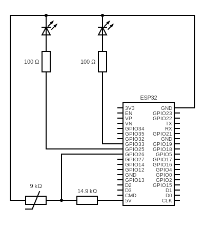

# Thermometer project

    This project aimed to make a thermometer to measure the temperature of the Agar in a behavioral experiment in Jovanic's Lab (Behavior and Neural Circuit - NeuroPSI)

## The circuit : 

NB : Check if the PINs in the circuit correspond with the ones in the code. 

## The principle : 

The 2 LEDs in the circuit are only here to check if the circuit is running and if it is reading and saving the temperature on the computer. 

### Measuring the temperature

To measure the temperature we use a simple current divider : 
$$ V_{out} = \frac{Z_2}{ Z_1 + Z_2 } V_{in}$$
Solving this equation and replacing the impedances by the one of the resistor we have : 
$$ R_{Therm} = R_{bias} \frac{V_{out}}{V_{in} - V_{out}}$$ 
with $R_{Therm} = Z_2 $ : the value of the thermistor, $R_{bias} = Z_1 = 14870 \, \Omega $ the value of the resistance. 

From this equation and the analog read using the ACD-GPIO26 we are able to determine the value of the resistance value of the thermistor. 

### Steinhart - Hart equation : 

To convert this resistance value to the temperature, we need to refer to this equation that is the relation between the resistance of a semi-conductor and the temperature : 

$$ \frac{1}{T} = A + B \ln(R) + C (\ln(R))^3 $$

with $A,B,C$ which are constants computed from 3 values of resistance/temperature to calibrate the thermometer.

From here all we need to do is to calibrate the thermometer by computing the $A,B$ and $C$ constants. 

To do that a solution already exists, you just need to have three measure of $(T,R)$ with $T$ in Kelvin and $R$ in Ohms :

We have : $ Y_1 = \frac{1}{T_1} $ , $ Y_2 = \frac{1}{T_2} $ and $ Y_3 = \frac{1}{T_3} $ and $ L_1 = \ln(R_1) $, $ L_2 = \ln(R_2) $ and $ L_3 = \ln(R_3) $

The solution of the equation to find the coefficients is the following : 

We first have : $$ a = (\frac{L_2 - L_3}{L_1 - L_2}) \times (L_2^3 - L_1^3) + (L_2^3 - L_3^3) $$ and $$ b = Y_2 - Y_3 - (\frac{L_2 - L_3}{L_1 - L_2}) \times (Y_1 - Y_2)$$ 

From here we have : $$ C = \frac{b}{a} $$
$$ B = (\frac{1}{L_1 - L_2}) \times [ Y_1 - Y_2 - (L_1^3 - L_2^3) \times C ] $$
$$ A = Y_1 - L_1 \times B - L_1^3 \times C $$ 

*** 

Then you just need to use the 1st equation to get the correponding temperature.

In my case the values of my thermistor where : 
- A = -0.0028561366320477345
- B = 0.0008955705709208325
- C = -2.551794536666231e-06

***

### GUI and control

Using the [GUI](gui.py), you are able to control and communicate with this circuit using the serial port. 

Refer to the code to see how it works.

You just need to run the [main.py](main.py) program with the ESP32 connect to the computer to start you measures. 

### Measure : 

The measure are the values of resistance that are computed on the ESP32 and them sent to the computer.

Those measured are then saved in a dataframe with the time it has been measured. 
And the "Save" Button allow you to save this dataframe as a .json in the location specified as the GUI parameter. 

## Be careful 

- Refer to the datasheet of the thermistor to see if the range of values of resistance you can measure are in the range of temperature you want to use the thermistor in. \
If your $R_{bias}$ value is to small, you may have arrive to a treshold of resistance if the temperature goes too low (NTC case), but if it is too high you will lose precision in your reads. 
